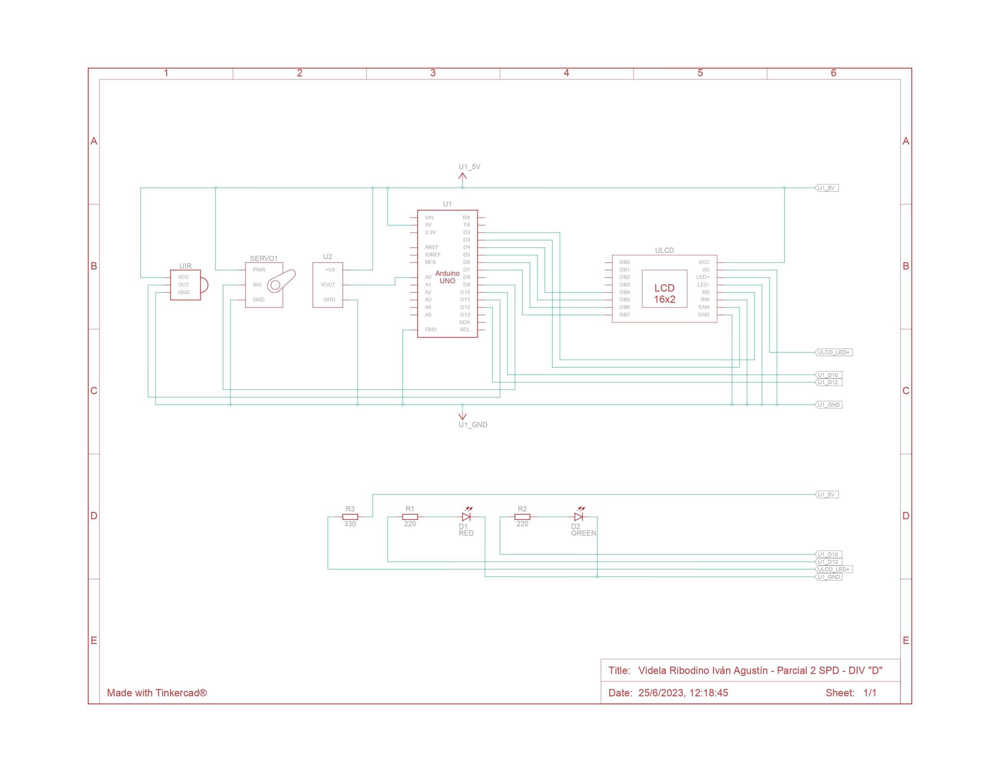

# PARCIAL 2 SPD - PARTE PRÁCTICA DOMICILIARIA - VIDELA R. IVÁN A.

## Proyecto: Montacargas

## Objetivo

El objetivo de este proyecto es diseñar un sistema de incendio utilizando Arduino que pueda
detectar cambios de temperatura y activar un servo motor en caso de detectar un incendio.
Además, se mostrará la temperatura actual y la estación del año en un display LCD.

### Componentes necesarios:

- Arduino UNO
- Sensor de temperatura
- Control remoto IR (Infrarrojo)
- Display LCD (16x2 caracteres)
- Servo motor
- Cables y resistencias según sea necesario
- Protoboard para realizar las conexiones
- Dos leds.
- Funcionalidad requerida:

### Conexiones:
- Conecta el sensor de temperatura al pin analógico A0 de Arduino.
- Conecta el control remoto IR al pin digital 11 de Arduino.
- Conecta el display LCD utilizando los pines correspondientes de Arduino.
- Conecta el servo motor a uno de los pines PWM de Arduino (por ejemplo, pin 9).

### Control remoto:
- Configura el control remoto IR para recibir señales.
- Define los comandos necesarios para activar y desactivar el sistema de incendio.
- Utiliza un algoritmo para determinar la estación del año (por ejemplo, rangos de temperatura para cada estación).

### Detección de temperatura:
- Configura el sensor de temperatura y realiza la lectura de la temperatura ambiente.
- Muestra la temperatura actual en el display LCD.

### Sistema de alarma:
- Define un umbral de temperatura a partir del cual se considera que hay un incendio (por ejemplo, temperatura superior a 60 grados Celsius).
- Cuando se detecta un incendio (temperatura por encima del umbral), se activa el servo motor para simular una respuesta del sistema de incendio.

### Mensajes en el display LCD:
- Muestra la temperatura actual y la estación del año en el display LCD.
- Cuando se detecta un incendio, muestra un mensaje de alarma en el display LCD.

### Punto libre:
- Se deberá agregar dos leds y darle una funcionalidad de su elección, acorde al proyecto previamente detallado.

### Aclaraciones para la aprobación de la parte práctica:
- Debe haber buen uso de las funciones.
- El código debe ser prolijo y legible.
- Debe poder explicar cada punto
- Debe poder modificar la funcionalidad agregando lo que sea necesario

### Documentación:
- Deberán presentar un diagrama esquemático del circuito y explicar el
funcionamiento aplicado de cada componente.
- Presentar el código fuente del proyecto de Arduino listo para ser
implementado.
- Deberán explicar el funcionamiento integral utilizando documentación
MarkDown.

## Diagrama esquemático del circuito

### Funcionamiento aplicado de cada componente: 

#### LEDS:
- D1 RED (LED Roja): El ánodo del LED está conectado a una resistencia (R1) de 220 Ohms y a la salida digital D12 del Arduino Uno (U1) El cátodo está conectado a GND (tierra) del U1. Cuando la salida digital D12 está en estado alto (HIGH/1), se aplica un voltaje a través del LED, lo que lo enciende y emite luz roja, si está en estado bajo (LOW/0) no se le aplica voltaje, lo que lo apaga y no emite luz.
- D2 GREEN (LED Verde): El ánodo del LED está conectado a una resistencia (R2) de 220 Ohms y a la salida digital D10 del Arduino Uno (U1). El cátodo está conectado a GND (tierra) del U1. Cuando la salida digital D11 está en estado alto (HIGH/1), se aplica un voltaje a través del LED, lo que lo enciende y emite luz verde, si está en estado bajo (LOW/0) no se le aplica voltaje, lo que lo apaga y no emite luz.

#### LCD 16 x 2 - ULCD:
- GND: conectado a GND (tierra) del U1.
- VCC: conectado a 5V del U1.
- VO: conectado a GND del U1.
- LED+: conectado a una resistencia (R3) de 220 ohms y a 5V del U1.
- LED-: conectado a GND del U1.
- RS: conectado al pin D2 (salida digital) del U1.
- RW: conectado a GND (tierra) del U1.
- ENA: conectado al pin D3 (salida digital) del U1.
- DB4: conectado al pin D4 (salida digital) del U1.
- DB5: conectado al pin D5 (salida digital) del U1.
- DB6: conectado al pin D6 (salida digital) del U1.
- DB7: conectado al pin D7 (salida digital) del U1.

#### SENSOR DE TEMPERATURA - TMP36:
- U2: Terminal GND conectado a GND (Tierra) del Arduino Uno (U1). Terminal VOUT conectado al pin A0 (entrada analógica) del U1. Terminal +VS conectado a 5V del U1.

#### MICROSERVOMOTOR:
- SERVO1: Terminal GND conectado a GND (Tierra) del Arduino Uno (U1). Terminal SIG conectado al pin D9 (entrada digital) del U1. Terminal PWR conectado a 5V del U1. 

#### SENSOR IR:
- UIR: Terminal OUT al pin D11 (entrada digital) del U1 Terminal GND conectado a GND (Tierra) del Arduino Uno (U1). Terminal VCC conectado a 5V del U1.

## Función principal

El código hace uso de varias funciones para que el sistema de incendios pueda detectar cambios de temperatura con el sensor de temperatura, activar un servo motor y prender una led roja en caso de detectar un incendio, prender una led verde si hay un estado normal de temperatura, junto a las propias estaciones del año en base a esta y mostrar todo esto en una pantalla LCD 16 x 2, entre estas funciones destaco la funcion principal detectarEstacionIncendioMostrarLCD(), esta función detecta la estación o un posible incendio en función de la temperatura recibida por parámetro. Dependiendo del rango de temperatura, se asigna un mensaje específico. El mensaje y la temperatura son mostradas luego en el LCD 2 líneas y 16 caracteres.

~~~ C (lenguaje en el que esta escrito)
void detectarEstacionIncendioMostrarLCD(int temperatura)
{ 
    if(temperatura >= -40 && temperatura <= 5)
    {
        mensaje = "Estacion: Invierno";
    }
    else if(temperatura > 5 && temperatura <= 20)
    {
        mensaje = "Estacion: Otonio";
    }
    else if(temperatura > 20 && temperatura <= 30)
    {
        mensaje = "Estacion: Primavera";
    }
    else if(temperatura > 30 && temperatura < 60)
    {
        mensaje = "Estacion: Verano";
    }
    else
    {
        mensaje = "ALERTA: INCENDIO";
    }
    
    lcd.setCursor(0, 0);
    lcd.print("Temperatura: ");
    lcd.print(temperatura);
    lcd.print("   ");
    lcd.setCursor(0, 1);
    lcd.print(mensaje);
}
~~~
### Otras Funciones

La función prenderApagarLedsServoIncendio se encarga de controlar los leds y el servo en función de la temperatura recibida como parámetro. Prende la led roja en caso de que la temperatura sea mayor o igual a 60, es decir hay un incendio, apaga la led verde en caso de estar prendida y mueve el servo a 180 durante 500ms, posteriormente a 0 durante 500ms y asi continuamente. en caso de que la temperatura sea una normal, es decir menor a 60 grados prende el led verde y apaga el led rojo, y mueve el servo a 0 grados.

~~~ C (lenguaje en el que esta escrito)
void prenderApagarLedsServoIncendio(int temperatura)
{
    if(temperatura >= 60)
    {
        prenderLed(LED_ROJO);
        apagarLed(LED_VERDE);
        myServo.write(180);
        delay(500);
        myServo.write(0);
        delay(500);
    }
    else
    {
        prenderLed(LED_VERDE);
        apagarLed(LED_ROJO);
        myServo.write(0);
    }
}
~~~

La función detectarSistemaPrendidoApagado se encarga de detectar si se presiona un botón en el receptor de infrarrojos. Si detecta un botón y coincide con el código hexadecimal de la variable boton_apagado_prendido, que sería el botón rojo del control remoto. Se cambia el estado del sistema (prendido/apagado), lo muestra en el puerto en serie y devuelve un booleano con el valor (true/false), en caso de que este prendido o apagado respectivamente.

~~~ C (lenguaje en el que esta escrito)
bool detectarSistemaPrendidoApagado()
{
    if(IrReceiver.decode())
    {
        if(IrReceiver.decodedIRData.decodedRawData == BOTON_APAGADO_PRENDIDO)
        {
            contadorSistema += 1;
            if(contadorSistema % 2 == 0)
            {
                sistemaPrendido = false;
                Serial.println("Sistema apagado");
            }
            else
            {
                sistemaPrendido = true;
                Serial.println("Sistema prendido");
            }
        }
        
        IrReceiver.resume();
    }
    delay(50);

    return sistemaPrendido;
}
~~~

Las funciones prenderLed y apagarLed prenden o apagan la led correspondiente pasada por parámetro solo si esta led ya se encuentra prendida o apagada, además avisan que color de led fue prendido o apagado.

~~~ C (lenguaje en el que esta escrito)
void prenderLed(int led)
{
    switch(led)
    {
        case LED_ROJO:
            if(ledRojoPrendido == false)
            {
                Serial.println("Led Rojo prendido");
                ledRojoPrendido = true;
            }
        break;
        case LED_VERDE:
            if(ledVerdePrendido == false)
            {
                Serial.println("Led Verde prendido");
                ledVerdePrendido = true;
            }
        break;
    }
    
    digitalWrite(led, HIGH);  
}

void apagarLed(int led)
{
    switch(led)
    {
        case LED_ROJO:
            if(ledRojoPrendido == true)
            {
                Serial.println("Led Rojo apagado");
                ledRojoPrendido = false;
            }
        break;
        case LED_VERDE:
            if(ledVerdePrendido == true)
            {
                Serial.println("Led Verde apagado");
                ledVerdePrendido = false;
            }
        break;
    }
    
    digitalWrite(led, LOW);
}
~~~

La funcion leerTemperaturaGrados se encarga de leer el valor del sensor recibido por parámetro, en este caso el sensor de temperatura y convierte los valores recibidos de la lectura en la temperatura en grados celsius con la función map. Luego devuelve esta temperatura.

~~~ C (lenguaje en el que esta escrito)
int leerTemperaturaGrados(int sensor)
{
    int lectorSensorTemperatura = analogRead(sensor);
    int gradosSensorTemperatura = map(lectorSensorTemperatura, 20, 358, -40, 125);
    
    return gradosSensorTemperatura;
}

~~~
En el loop principal del código primero se detecta si el sistema está prendido, con la función detectarSistemaPrendidoApagado. Si el sistema está prendido se lee la temperatura con la funcion leerTemperaturaGrados, se detecta la estación/incendio y se la muestra en el LCD con la función detectarEstacionIncendioMostrarLCD y se controlan los leds y el servo con la función prenderApagarLedsServoIncendio.
En caso de que el sistema esté apagado, se limpia el LCD, se apagan los leds y se pone el servo en la posición inicial de 0 grados.

~~~ C (lenguaje en el que esta escrito)
void loop()
{
    bool sistemaPrendido = detectarSistemaPrendidoApagado();

    if(sistemaPrendido)
    {
        int temperatura = leerTemperaturaGrados(SENSOR_TEMPERATURA);
        detectarEstacionIncendioMostrarLCD(temperatura);
        prenderApagarLedsServoIncendio(temperatura);
    }
    else
    {
        lcd.clear();
        lcd.noCursor();
        myServo.write(0);
        apagarLed(LED_ROJO);
        apagarLed(LED_VERDE);
    }
} 

~~~

## :robot: Link al proyecto
- [Proyecto](https://www.tinkercad.com/things/g1DfesiNZxt-videla-ribodino-ivan-agustin-parcial-2-spd-div-d)
